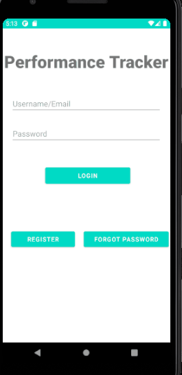

<h1>Performance Tracker</h1>

    An android application using Java that enables the student to measure the daily performance level through the streak points by completing different priorities of tasks within a deadline. 

<h2>Features</h2>
<ul>
<li>Student can import classes and assignments from Canvas Learning Management System (LMS)</li>
<li>Student can manually add assignments/task and set the priority level.</li>
<li>Student can earn the streak points upon completing those tasks.</li>
<li>Student can monitor their daily performance level through streak history.</li>
</ul>

<h2>App Demo</h2>

<h2>Programming Languages and Tools used</h2>

    <strong>Programming Languages</strong>: <ul><li>Java</li><li> XML</li></ul>

<strong>Tools</strong>
    <ul>
        <li>
            Google Firebase Authentication was used to authenticate users
        </li>
        <li>
            Google Firestore (NoSQL Database) was used to maintain the user records
        </li>
        <li>
            Canvas LMS REST API was used to generate new tasks from the Class’ portal.
        </li>
   </ul>
       

<h2>Coding Structure</h2>

All the layout (Activity and Fragment Layout) is located in the sub-dir: <a href="./app/src/main/res/layouts/" title="Layouts">/app/src/main/res/layouts/</a> 
In Layout, the xml file name and id of element is written in <strong>snake-case</strong> formatting.  
All the Java files is located in the sub-dir: <a href="/app/src/main/java/" title="Java">/app/src/main/java/</a> 
Inside of it, the <a href="./app/src/main/java/templates_and_keys/" title="Template and Keys">template_and_keys</a> hold all the blue-print of objects like Classes, Task, User,Streak, SessionManagement and Priority, and <a href="./app/src/main/java/com/example/performance_tracker/" title="implementation">/app/src/main/java/com/example/performance_tracker/</a> hods the implementation of the templates. 
All Java Class name is in <strong>Pascal Case</strong>, whereas, all the variables and methods are in <strong>Camel Case</strong>

<h2>How to Run the Code</h2>
<h3>Step 1:</h3>

Clone this repository: git@github.com:hprabesh/android-performance-tracker.git

<h3>Step 2:</h3>

Set up the firebase account: Follow Google's documentation on <a href="https://firebase.google.com/docs/android/setup" target="_blank" title="Create Firebase Account">how to set up firebase account</a>

In the firebase console, enable the firestore database, and set up the database rule on how users perform CRUD operation. 

    <em>This is the one that I used</em> 
    

    

<strong>Rule</strong>:
<pre>
 <code>
rules_version = '2';
service cloud.firestore {
  match /databases/{database}/documents {
    match /{document=**} {
      allow read, write: if
          request.auth!=null;
    }
  }
}
</code>
</pre>

<h3>Step 3:</h3>

Please make sure that <a href="./app/google-services.json" title="Google Services JSON">/app/google-services.json</a> has been updated with the new keys.

(<em>Please follow the google documentation on <a href="https://developers.google.com/android/guides/google-services-plugin" target="_blank" title="Google Services JSON DOCS"> how to set up google-services.json file</a></em>)

<h2>How to use the App<h2>
<h3>Login and Registration</h3>

Login and Registration is a straight forward process. Fill out the registration page and then you will receive a link for the verification in your email to verify the account

<h3>Add Task, Add Class View Streak Points and Mark Task Completed</h3>

Please view the <a href="#demo" title="Demo Gif">demo above</a> on how to add tasks, set priority, create deadline and all those good stuff. 

<h3>Importing the classes and assignments from Canvas LMS</h3>

Importing the classes and assignments from Canvas LMS requires you to generate a new API Key. So, please visit this site <a href="https://canvas.instructure.com/doc/api/file.oauth.html#manual-token-generation" title="Canvas" target="_blank">Canvas Manual Token Generation</a> on how to generate token  (<em>Please follow the Canvas Terms and Conditions about using OAuth2.0 and Manual API Token</em>).   Finally, copy that token, and click on <strong>Import Class from Canvas</strong> and paste it in the pop-up box, and then you can import the classes and assignments.  

<em>Please view the <a href="#demo" title="Demo Gif">demo above</a> to learn how to add the API Key</em>

